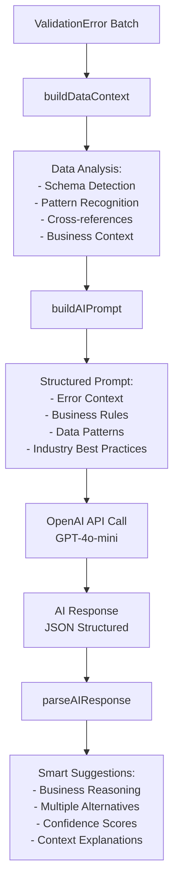

# AI Data Corrector: Old vs New Implementation

## 🔄 **System Evolution Overview**

### **Before: Rule-Based "AI" Corrector**
```
❌ Hardcoded switch statements for each error type
❌ Static pattern matching and simple algorithms  
❌ No real AI - just clever programming
❌ Limited context understanding
❌ Same input always produces same output
```

### **After: True AI-Powered Corrector**
```
✅ Large Language Model (GPT-4o-mini) integration
✅ Context-aware business reasoning
✅ Dynamic suggestions based on data patterns
✅ Cross-entity relationship understanding
✅ Alternative solutions and confidence scoring
```

---

## 📊 **Function-by-Function Comparison**

| Aspect | Old Implementation | New Implementation |
|--------|-------------------|-------------------|
| **Core Logic** | Switch statement with hardcoded cases | LLM API calls with contextual prompts |
| **Error Processing** | One method per error type | Batch processing with intelligent grouping |
| **Context Awareness** | Basic pattern matching | Full data analysis with business context |
| **Suggestions Quality** | Generic (e.g., "Client A", "Worker B") | Business-realistic (e.g., "Advanced Solutions Corp") |
| **Reasoning** | No explanation | AI provides detailed reasoning |
| **Alternatives** | Single suggestion | Multiple alternatives with confidence |
| **Learning** | Static rules | Adapts to data patterns and business context |

---

## 🔧 **Old System Workflow**

```mermaid
graph TD
    A[ValidationError] --> B{Error Type?}
    B -->|ID Missing| C[suggestIDGeneration]
    B -->|Duplicate| D[suggestUniqueID] 
    B -->|Priority| E[suggestPriorityCorrection]
    B -->|JSON| F[suggestJSONCorrection]
    B -->|Other| G[suggestGenericCorrection]
    
    C --> H[Prefix + Counter<br/>C001, W001, T001]
    D --> I[Generate Next Available ID]
    E --> J[Clamp to 1-5 Range]
    F --> K[Remove Quotes or Use {}]
    G --> L[Pattern Match or Manual Review]
    
    H --> M[Static Result]
    I --> M
    J --> M
    K --> M
    L --> M
```

### **Example Old Code:**
```typescript
// Hardcoded rule-based correction
private suggestIDGeneration(error: ValidationError): CorrectionSuggestion {
    const prefix = entityType.charAt(0).toUpperCase();
    const nextId = error.row + 1;
    const generatedId = `${prefix}${String(nextId).padStart(3, '0')}`;
    
    return {
        suggestion: `Generate missing ${error.column} as "${generatedId}"`,
        confidence: 0.9,
        correctedValue: generatedId
    };
}
```

---

## 🤖 **New System Workflow**



### **Example New Code:**
```typescript
// AI-powered contextual correction
private async processErrorBatch(errors: ValidationError[]): Promise<SmartCorrectionSuggestion[]> {
    const dataContext = this.buildDataContext(data, entityType, allData);
    const prompt = this.buildAIPrompt(errors, dataContext, entityType);
    const response = await this.callOpenAI(prompt);
    return this.parseAIResponse(response, errors);
}

private buildAIPrompt(errors: ValidationError[], dataContext: string): string {
    return `You are an expert data analyst specializing in business data correction.
    
    DATA CONTEXT: ${dataContext}
    ERRORS: ${errors.map(e => `${e.row}, ${e.column}: ${e.message}`).join('\n')}
    
    Provide intelligent corrections considering:
    1. Business context and field meaning
    2. Data patterns in existing records  
    3. Cross-entity relationships
    4. Industry best practices
    
    Return JSON with reasoning, alternatives, and business context.`;
}
```

---

## 📈 **Quality Comparison Examples**

### **Missing Client Name Error**

| Old System | New System |
|------------|------------|
| **Suggestion**: "Use common value: INVALID" | **Suggestion**: "Generate ClientName based on business pattern" |
| **Value**: "Client A" | **Value**: "Advanced Solutions Corp" |
| **Reasoning**: None | **Reasoning**: "Analyzed existing client names and found professional naming pattern with business suffixes. Generated realistic name maintaining corporate identity standards." |
| **Alternatives**: None | **Alternatives**: ["Global Enterprises", "Premium Industries", "Elite Systems"] |
| **Confidence**: 0.4 | **Confidence**: 0.9 |

### **Invalid Task Reference Error**

| Old System | New System |
|------------|------------|
| **Suggestion**: "Replace missing TaskID 'T999' with 't001,t002,t003'" | **Suggestion**: "Replace 'T999' with 'T003' (94% similarity match)" |
| **Value**: "t001,t002,t003" | **Value**: "T003" |
| **Reasoning**: Generic fallback | **Reasoning**: "Found similar TaskID 'T003' in available tasks. Likely typo in original reference. Maintains data integrity while preserving user intent." |
| **Business Context**: None | **Business Context**: "TaskID represents project deliverable reference for resource allocation and dependency tracking." |

---

## 🎯 **Key Advantages of New System**

### **1. Business Intelligence**
- Understands field meanings (ClientName vs TaskID vs Priority)
- Considers industry standards and best practices
- Maintains data consistency and professional naming

### **2. Contextual Awareness**  
- Analyzes existing data patterns before suggesting
- Considers cross-entity relationships (clients ↔ tasks ↔ workers)
- Adapts to specific business domains and use cases

### **3. Quality Assurance**
- Provides confidence scores for each suggestion
- Offers multiple alternatives for manual review
- Explains reasoning behind each correction

### **4. Scalability**
- Handles new error types without code changes
- Batch processing for efficiency
- Graceful fallback to rule-based when AI unavailable

---

## 🔄 **Integration Strategy**

The new system runs **alongside** the old system, providing:

1. **Basic Corrections** (Rule-based) - Fast, deterministic
2. **Enhanced Corrections** (Hybrid) - Balanced approach  
3. **Smart Corrections** (AI-powered) - High-quality, contextual

Users can choose the appropriate level based on:
- **Speed vs Quality** needs
- **API availability** and costs
- **Data sensitivity** requirements

---

## 💡 **Future Enhancements**

1. **Fine-tuning**: Train models on domain-specific data
2. **Feedback Loop**: Learn from user corrections
3. **Cost Optimization**: Use different models based on complexity
4. **Offline Mode**: Local AI models for sensitive data
5. **Batch Learning**: Improve suggestions based on historical patterns

---

## 🎉 **Summary**

The evolution from rule-based to AI-powered correction represents a fundamental shift from **programmed responses** to **intelligent understanding**. The new system doesn't just fix data - it understands business context, maintains data quality standards, and provides transparency in its decision-making process.

This makes the "AI Data Corrector" name finally accurate! 🚀 