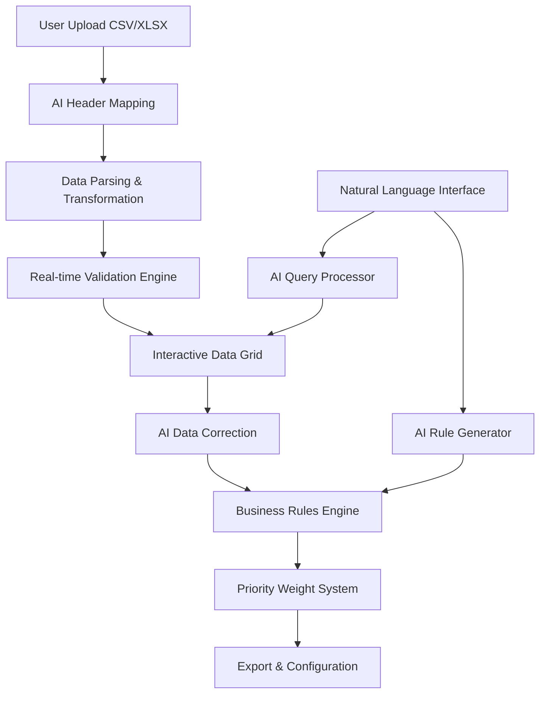
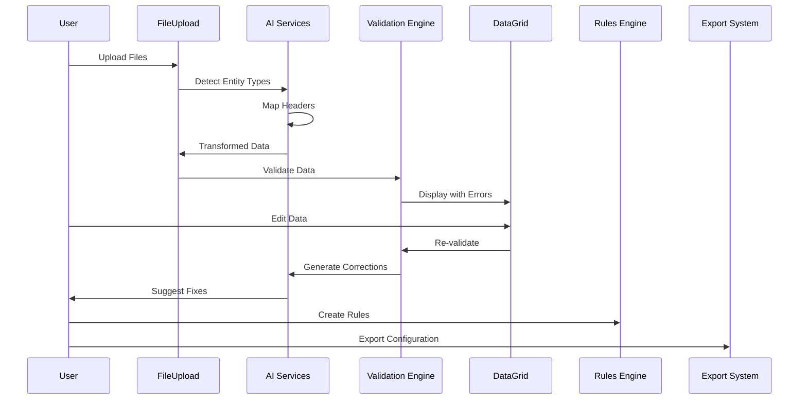

# 🚀 Data Alchemist: Comprehensive Documentation

## Table of Contents
1. [High Level Design (HLD)](#high-level-design-hld)
2. [Low Level Design (LLD)](#low-level-design-lld)
3. [Component Architecture](#component-architecture)
4. [Utils Layer Logic](#utils-layer-logic)
5. [Implementation Roadmap](#implementation-roadmap)
6. [Detailed Interfaces](#detailed-interfaces)
7. [AI Integration Strategy](#ai-integration-strategy)
8. [Additional Resources](#additional-resources)

---

## High Level Design (HLD)

### System Overview
The Data Alchemist is an AI-powered Next.js web application that transforms chaotic spreadsheet data into organized, validated, and rule-based resource allocation configurations.



### Core Architecture Principles
1. **AI-First Design**: Every major operation leverages AI for enhanced user experience
2. **Real-time Feedback**: Immediate validation and correction suggestions
3. **Non-technical User Focus**: Natural language interfaces and intuitive UIs
4. **Modular Design**: Loosely coupled components for maintainability
5. **Performance Optimization**: Parallel processing and debounced operations

### System Boundaries
- **Input**: CSV/XLSX files (clients, workers, tasks)
- **Processing**: Validation, AI correction, rule generation
- **Output**: Clean CSV files + rules.json configuration
- **Users**: Non-technical business users managing resource allocation

---

## Low Level Design (LLD)

### Data Flow Architecture



### Component Hierarchy

```
App (page.tsx)
├── FileUpload
├── DataGrid
│   ├── ValidationHighlighter
│   └── InlineEditor
├── RuleBuilder
│   ├── RuleTypeSelector
│   └── NaturalLanguageInput
├── PriorityWeights
│   ├── WeightSliders
│   └── ProfileSelector
├── ExportSystem
│   ├── ValidationChecker
│   └── FileGenerator
└── AI Services
    ├── HeaderMapper
    ├── DataCorrector
    ├── QueryProcessor
    └── RuleGenerator
```

---

## Component Architecture

### 1. FileUpload Component
**Purpose**: Handle CSV/XLSX file ingestion with AI-powered parsing

**Logic Flow**:
```typescript
1. User drops/selects files
2. Validate file types (CSV/XLSX)
3. Parse files using appropriate parser
4. AI detects entity type (client/worker/task)
5. AI maps headers to expected schema
6. Transform data using entity-specific mappers
7. Merge data into application state
8. Trigger validation pipeline
```

**Key Features**:
- Drag & drop interface
- Multi-file processing
- Progress indicators
- Error handling for malformed files

### 2. DataGrid Component
**Purpose**: Interactive data table with inline editing and validation highlighting

**Logic Flow**:
```typescript
1. Receive data and validation errors
2. Render table with sortable columns
3. Highlight cells with validation errors
4. Enable inline editing for data correction
5. Debounce validation on changes
6. Show contextual error tooltips
7. Integrate with AI correction suggestions
```

**Key Features**:
- Virtual scrolling for large datasets
- Real-time validation feedback
- Bulk edit operations
- Export selected rows

### 3. RuleBuilder Component
**Purpose**: Visual and natural language rule creation interface

**Logic Flow**:
```typescript
1. Present rule type templates
2. Allow parameter configuration
3. Accept natural language input
4. AI converts text to structured rules
5. Validate rule logic against data
6. Preview rule effects
7. Save to rules collection
```

**Rule Types**:
- Co-run rules
- Slot restrictions
- Load limits
- Phase windows
- Pattern matching
- Precedence overrides

### 4. PriorityWeights Component
**Purpose**: Configure resource allocation priorities

**Logic Flow**:
```typescript
1. Display priority criteria
2. Provide weight adjustment interfaces
3. Offer preset profiles
4. Calculate composite scores
5. Show impact preview
6. Save weight configuration
```

**Interface Types**:
- Slider controls
- Drag-and-drop ranking
- Pairwise comparison matrix
- Preset profile selection

### 5. ExportSystem Component
**Purpose**: Generate clean data and configuration files

**Logic Flow**:
```typescript
1. Validate all data completeness
2. Apply final data transformations
3. Generate CSV files per entity
4. Create rules.json configuration
5. Package priority weights
6. Provide download links
```

---

## Utils Layer Logic

### 1. parsers.ts
**Purpose**: Data parsing and transformation utilities

```typescript
// Core Functions:
parseCSV(file: File) => Promise<any[]>
parseExcel(file: File) => Promise<any[]>
transformClientData(rawData: any[]) => Client[]
transformWorkerData(rawData: any[]) => Worker[]
transformTaskData(rawData: any[]) => Task[]

// Logic:
1. Use Papa Parse for CSV processing
2. Use XLSX library for Excel files
3. Apply data type conversions
4. Handle malformed data gracefully
5. Normalize field names and values
```

### 2. validation.ts
**Purpose**: Comprehensive data validation engine

```typescript
// Validation Categories:
1. Required Field Validation
2. Data Type Validation
3. Cross-Reference Validation
4. Business Logic Validation
5. Constraint Validation

// Key Validations:
- Missing required columns
- Duplicate IDs
- Malformed lists/JSON
- Out-of-range values
- Broken cross-references
- Circular dependencies
- Resource conflicts
- Skill coverage gaps
```

### 3. ai-header-mapper.ts
**Purpose**: AI-powered header mapping and entity detection

```typescript
class AIHeaderMapper {
  async detectEntityType(headers: string[]): Promise<EntityDetection>
  async mapHeaders(headers: string[], entityType: EntityType): Promise<MappingResult>
  
  // Logic:
  1. Analyze header patterns using ML models
  2. Score similarity to known schemas
  3. Handle variations and typos
  4. Provide confidence scores
  5. Suggest unmapped headers
}
```

### 4. ai-data-corrector.ts
**Purpose**: AI-driven data correction suggestions

```typescript
class AIDataCorrector {
  async suggestCorrections(data: any[], errors: ValidationError[]): Promise<CorrectionSuggestion[]>
  async applyCorrection(data: any[], suggestion: CorrectionSuggestion): Promise<any[]>
  
  // Logic:
  1. Analyze validation errors
  2. Generate context-aware corrections
  3. Provide confidence scores
  4. Support bulk corrections
  5. Learn from user acceptance patterns
}
```

### 5. ai-query-processor.ts
**Purpose**: Natural language query processing

```typescript
class AIQueryProcessor {
  async processQuery(query: string, data: AppData): Promise<QueryResult>
  
  // Logic:
  1. Parse natural language intent
  2. Extract filter criteria
  3. Generate data queries
  4. Execute filtered searches
  5. Return structured results
}
```

### 6. ai-config.ts
**Purpose**: AI service configuration and initialization

```typescript
// Configuration for:
- API endpoints and keys
- Model parameters
- Timeout settings
- Fallback strategies
- Performance optimization
```

---

## Implementation Roadmap

### Milestone 1: Data Ingestion & Validation (Days 1-2)

#### Phase 1.1: Core Infrastructure
```typescript
✅ Project setup with Next.js + TypeScript
✅ File upload component with drag-and-drop
✅ CSV/XLSX parsing utilities
✅ Basic data grid display
✅ Entity type detection
```

#### Phase 1.2: AI-Powered Parsing
```typescript
🔄 AI header mapping implementation
🔄 Entity type auto-detection
🔄 Data transformation pipeline
🔄 Error handling and recovery
```

#### Phase 1.3: Validation Engine
```typescript
📋 Core validation rules (8+ required)
📋 Real-time validation feedback
📋 Error highlighting in grid
📋 Validation summary dashboard
```

#### Phase 1.4: Natural Language Search
```typescript
📋 Query processing engine
📋 Search interface
📋 Result filtering and display
📋 Query history and suggestions
```

### Milestone 2: Rules & Priorities (Day 2-3)

#### Phase 2.1: Rule Builder UI
```typescript
📋 Visual rule creation interface
📋 Rule type templates
📋 Parameter configuration
📋 Rule validation and preview
```

#### Phase 2.2: Natural Language Rules
```typescript
📋 NL to rule conversion
📋 Context-aware rule generation
📋 Rule conflict detection
📋 Rule effectiveness analysis
```

#### Phase 2.3: Priority System
```typescript
📋 Weight configuration interface
📋 Preset profiles
📋 Impact visualization
📋 Priority optimization
```

### Milestone 3: AI Enhancement & Export (Day 3)

#### Phase 3.1: AI Data Correction
```typescript
📋 Correction suggestion engine
📋 One-click fix application
📋 Bulk correction operations
📋 Learning from user feedback
```

#### Phase 3.2: Export System
```typescript
📋 Data validation for export
📋 CSV file generation
📋 Rules.json creation
📋 Configuration packaging
```

#### Phase 3.3: Polish & Optimization
```typescript
📋 Performance optimization
📋 UI/UX improvements
📋 Error handling refinement
📋 Documentation completion
```

---

## Detailed Interfaces

### Core Data Types

```typescript
// Entity Interfaces
interface Client {
  ClientID: string;
  ClientName: string;
  PriorityLevel: number; // 1-5
  RequestedTaskIDs: string[];
  GroupTag: string;
  AttributesJSON: any;
}

interface Worker {
  WorkerID: string;
  WorkerName: string;
  Skills: string[];
  AvailableSlots: number[];
  MaxLoadPerPhase: number;
  WorkerGroup: string;
  QualificationLevel: number;
}

interface Task {
  TaskID: string;
  TaskName: string;
  Category: string;
  Duration: number;
  RequiredSkills: string[];
  PreferredPhases: number[];
  MaxConcurrent: number;
}

// Validation Interfaces
interface ValidationError {
  id: string;
  entityType: 'client' | 'worker' | 'task';
  entityId: string;
  field: string;
  type: 'error' | 'warning';
  message: string;
  severity: 'low' | 'medium' | 'high' | 'critical';
  suggestion?: string;
}

interface ValidationSummary {
  totalErrors: number;
  totalWarnings: number;
  errorsByType: Record<string, number>;
  completionRate: number;
  lastValidated: Date;
}

// AI Interfaces
interface MappingResult {
  mappings: Record<string, HeaderMapping>;
  unmappedHeaders: string[];
  confidence: number;
  suggestions: string[];
}

interface CorrectionSuggestion {
  id: string;
  error: ValidationError;
  suggestion: string;
  confidence: number;
  action: 'auto-fix' | 'manual-review' | 'ignore';
  previewData?: any;
}

// Business Rules Interfaces
interface BusinessRule {
  id: string;
  type: 'coRun' | 'slotRestriction' | 'loadLimit' | 'phaseWindow' | 'patternMatch';
  name: string;
  description: string;
  parameters: Record<string, any>;
  enabled: boolean;
  priority: number;
  created: Date;
  lastModified: Date;
}

interface PriorityWeight {
  id: string;
  criterion: string;
  weight: number;
  description: string;
  category: 'performance' | 'fairness' | 'efficiency' | 'constraints';
}
```

### Component Props Interfaces

```typescript
interface DataGridProps {
  data: any[];
  entityType: 'client' | 'worker' | 'task';
  onDataChange: (updatedData: any[], immediate?: boolean) => void;
  validationErrors: ValidationError[];
  allData: AppData;
}

interface RuleBuilderProps {
  rules: BusinessRule[];
  onRulesChange: (rules: BusinessRule[]) => void;
  appData: AppData;
  onGenerateConfig: () => void;
}

interface PriorityWeightsProps {
  weights: PriorityWeight[];
  onWeightsChange: (weights: PriorityWeight[]) => void;
  onProfileSelect: (profile: PriorityProfile) => void;
}
```

---

## AI Integration Strategy

### 1. AI Service Architecture

```typescript
// AI Service Base Class
abstract class AIService {
  protected apiKey: string;
  protected baseUrl: string;
  protected timeout: number;
  
  abstract processRequest(input: any): Promise<any>;
  protected handleError(error: Error): void;
  protected validateResponse(response: any): boolean;
}

// Specific AI Services
class OpenAIService extends AIService {
  async generateCompletion(prompt: string): Promise<string>;
  async analyzeData(data: any[]): Promise<AnalysisResult>;
}

class CustomModelService extends AIService {
  async classifyHeaders(headers: string[]): Promise<Classification>;
  async suggestCorrections(errors: ValidationError[]): Promise<Suggestion[]>;
}
```

### 2. AI Prompt Engineering

```typescript
// Header Mapping Prompts
const HEADER_MAPPING_PROMPT = `
Analyze the following CSV headers and map them to the expected schema:
Expected: ${JSON.stringify(expectedSchema)}
Actual: ${JSON.stringify(actualHeaders)}

Provide mapping with confidence scores and suggestions for unmapped headers.
`;

// Data Correction Prompts
const CORRECTION_PROMPT = `
Given the validation error: "${error.message}"
And data context: ${JSON.stringify(context)}

Suggest a specific correction with high confidence.
Explain the reasoning and provide the exact fix.
`;

// Rule Generation Prompts
const RULE_GENERATION_PROMPT = `
Convert this natural language rule to structured format:
Input: "${naturalLanguageRule}"
Context: ${JSON.stringify(dataContext)}

Output a valid BusinessRule object with proper parameters.
`;
```

### 3. AI Performance Optimization

```typescript
class AIOptimizer {
  // Batch Processing
  async batchProcess<T>(items: T[], processor: (item: T) => Promise<any>): Promise<any[]> {
    const batches = this.createBatches(items, 10);
    return Promise.all(batches.map(batch => 
      Promise.all(batch.map(processor))
    )).then(results => results.flat());
  }
  
  // Caching Strategy
  private cache = new Map<string, { result: any; timestamp: number }>();
  
  async getCachedResult(key: string, generator: () => Promise<any>): Promise<any> {
    const cached = this.cache.get(key);
    if (cached && Date.now() - cached.timestamp < 300000) { // 5 min cache
      return cached.result;
    }
    
    const result = await generator();
    this.cache.set(key, { result, timestamp: Date.now() });
    return result;
  }
  
  // Progressive Enhancement
  async progressiveProcess(data: any[]): Promise<ProcessingResult> {
    // Start with basic processing
    const basicResult = await this.basicProcess(data);
    
    // Enhance with AI in background
    setTimeout(async () => {
      const enhancedResult = await this.aiEnhancedProcess(data);
      this.updateUI(enhancedResult);
    }, 100);
    
    return basicResult;
  }
}
```

---

## Additional Resources

### 1. Technical Implementation Tips

#### Performance Optimization
```typescript
// Use React.useMemo for expensive calculations
const validatedData = useMemo(() => {
  return validateData(appData);
}, [appData]);

// Implement virtual scrolling for large datasets
const VirtualizedGrid = ({ data, rowHeight = 50 }) => {
  // Use react-window or similar
};

// Debounce validation to avoid excessive API calls
const debouncedValidation = useMemo(
  () => debounce((data) => runValidation(data), 1000),
  []
);
```

#### Error Handling Strategy
```typescript
class ErrorHandler {
  static handleAIError(error: AIError): UserFriendlyError {
    switch (error.type) {
      case 'RATE_LIMIT':
        return { message: 'AI service temporarily busy. Please try again.' };
      case 'TIMEOUT':
        return { message: 'Processing taking longer than expected.' };
      default:
        return { message: 'AI assistance unavailable. Basic features still work.' };
    }
  }
  
  static withFallback<T>(aiOperation: () => Promise<T>, fallback: () => T): Promise<T> {
    return aiOperation().catch(() => fallback());
  }
}
```

### 2. Testing Strategy

```typescript
// Unit Tests
describe('ValidationEngine', () => {
  test('should detect duplicate IDs', () => {
    const data = [{ ClientID: 'C1' }, { ClientID: 'C1' }];
    const errors = validationEngine.validateDuplicates(data, 'ClientID');
    expect(errors).toHaveLength(1);
  });
});

// Integration Tests
describe('AI Header Mapping', () => {
  test('should map common variations', async () => {
    const headers = ['client_id', 'Client Name', 'priority_lvl'];
    const result = await aiHeaderMapper.mapHeaders(headers, 'client');
    expect(result.mappings['client_id'].expectedHeader).toBe('ClientID');
  });
});

// E2E Tests with Playwright
test('complete workflow', async ({ page }) => {
  await page.goto('/');
  await page.setInputFiles('input[type="file"]', 'samples/clients.csv');
  await expect(page.locator('.validation-summary')).toBeVisible();
  await page.click('button:has-text("Export")');
  // Verify download
});
```

### 3. Deployment Checklist

```typescript
// Environment Configuration
const config = {
  AI: {
    OPENAI_API_KEY: process.env.OPENAI_API_KEY,
    MODEL_VERSION: process.env.MODEL_VERSION || 'gpt-4',
    MAX_TOKENS: parseInt(process.env.MAX_TOKENS || '2000'),
  },
  APP: {
    MAX_FILE_SIZE: process.env.MAX_FILE_SIZE || '10MB',
    ALLOWED_FORMATS: ['csv', 'xlsx'],
    VALIDATION_TIMEOUT: 5000,
  }
};

// Production Optimizations
const optimizations = {
  // Code splitting
  dynamic: () => import('./HeavyComponent'),
  
  // Service worker for offline capability
  serviceWorker: '/sw.js',
  
  // CDN for static assets
  assetPrefix: process.env.CDN_URL,
  
  // Analytics
  analytics: {
    track: (event: string, properties: any) => {
      // Implementation
    }
  }
};
```

### 4. Advanced Features to Consider

#### Real-time Collaboration
```typescript
// WebSocket integration for multi-user editing
class CollaborationService {
  private ws: WebSocket;
  
  broadcastChange(change: DataChange): void {
    this.ws.send(JSON.stringify({ type: 'DATA_CHANGE', change }));
  }
  
  onRemoteChange(callback: (change: DataChange) => void): void {
    this.ws.onmessage = (event) => {
      const message = JSON.parse(event.data);
      if (message.type === 'DATA_CHANGE') {
        callback(message.change);
      }
    };
  }
}
```

#### Advanced AI Features
```typescript
// Predictive Data Entry
class PredictiveEntry {
  async suggestNext(partialData: any, context: any[]): Promise<Suggestion[]> {
    // Use AI to predict likely next values
  }
  
  async validateInRealTime(value: any, field: string): Promise<ValidationResult> {
    // Real-time validation with AI enhancement
  }
}

// Anomaly Detection
class AnomalyDetector {
  async detectOutliers(data: any[]): Promise<Anomaly[]> {
    // AI-powered outlier detection
  }
  
  async explainAnomaly(anomaly: Anomaly): Promise<Explanation> {
    // Natural language explanation of why something is anomalous
  }
}
```

This comprehensive documentation provides a complete roadmap for implementing the Data Alchemist project with AI-first principles, scalable architecture, and user-focused design. 